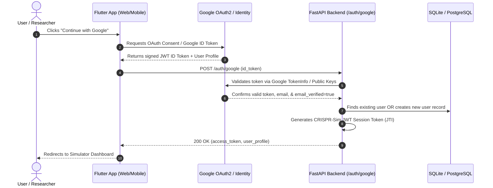

# Google Sign-In Setup & Configuration Guide

This guide provides complete, step-by-step instructions to set up **Google Sign-In & Registration** for the CRISPR-Sim application across Web, Android, iOS, and Backend API.

---

## Why Google Authentication?

1. **Real Email Verification**: Enforces that every user authenticates with an authentic, verified email address (`email_verified: true` cryptographically signed by Google).
2. **One-Click Onboarding**: Seamless registration without needing manual password creation.
3. **Enterprise DevSecOps Compliance**: Replaces unverified registration forms with OAuth 2.0 OpenID Connect (OIDC) identity federation.

---

## Architecture Flow



---

## Step-by-Step Setup Instructions

### Step 1: Create a Google Cloud Project
1. Navigate to the [Google Cloud Console](https://console.cloud.google.com/).
2. Click **Select a Project** at the top left > **New Project**.
3. Name your project (e.g., `CRISPR-Sim-Production`) and click **Create**.

---

### Step 2: Configure the OAuth Consent Screen
1. In the left navigation menu, go to **APIs & Services** > **OAuth consent screen**.
2. Select **User Type**:
   - **External**: Allows any user with a Google account to sign in (Recommended).
   - **Internal**: Restricts sign-in to users inside your Google Workspace organization.
3. Click **Create**.
4. Fill in the **App Information**:
   - **App name**: `CRISPR-Sim`
   - **User support email**: Your email address
   - **Developer contact information**: Your email address
5. Click **Save and Continue**.
6. On the **Scopes** page:
   - Click **Add or Remove Scopes**.
   - Check `.../auth/userinfo.email`, `.../auth/userinfo.profile`, and `openid`.
   - Click **Update** > **Save and Continue**.
7. If your app is in "Testing" status, add your test email under **Test Users** > click **Save and Continue**.

---

### Step 3: Create OAuth 2.0 Client IDs

#### 1. Web Application Client ID (For Flutter Web / Chrome)
1. Go to **APIs & Services** > **Credentials**.
2. Click **Create Credentials** > **OAuth client ID**.
3. Select **Application type**: `Web application`.
4. Name it: `CRISPR-Sim Web Client`.
5. Under **Authorized JavaScript origins**, add:
   - `http://localhost:3000`
   - `http://127.0.0.1:3000`
   - `http://localhost:8000`
   - `https://your-production-domain.com` (if deployed)
6. Under **Authorized redirect URIs**, add:
   - `http://localhost:3000`
   - `http://127.0.0.1:3000`
   - `https://your-production-domain.com`
7. Click **Create**.
8. Copy your **Client ID** (e.g., `1234567890-abcdef.apps.googleusercontent.com`) and **Client Secret**.

#### 2. Android Client ID (For Android Mobile App)
1. In **Credentials**, click **Create Credentials** > **OAuth client ID**.
2. Select **Application type**: `Android`.
3. Name it: `CRISPR-Sim Android Client`.
4. Set **Package name**: `org.crisprsim.app`
5. To get your **SHA-1 certificate fingerprint**, run in PowerShell / Terminal:
   ```powershell
   keytool -list -v -keystore ~/.android/debug.keystore -alias androiddebugkey -storepass android -keypass android
   ```
6. Copy the `SHA1:` hexadecimal string into Google Cloud Console.
7. Click **Create**.

#### 3. iOS Client ID (For iOS Mobile App)
1. Click **Create Credentials** > **OAuth client ID**.
2. Select **Application type**: `iOS`.
3. Set **Bundle ID**: `org.crisprsim.app`.
4. Click **Create**.

---

### Step 4: Configure Backend Environment Variables

Add your Google Client credentials to your backend environment or `.env` file:

```env
# Google OAuth Configuration
GOOGLE_CLIENT_ID=your-client-id-here.apps.googleusercontent.com
GOOGLE_CLIENT_SECRET=your-client-secret-here

# Authentication Mode
REQUIRE_AUTH=true
DATABASE_URL=sqlite:///./crispr.db
JWT_SECRET=your-secure-jwt-secret
```

---

### Step 5: Test and Verify Google Authentication

#### 1. Test via API (cURL / Python)
```bash
curl -X POST http://127.0.0.1:8000/auth/google \
  -H "Content-Type: application/json" \
  -d '{
    "id_token": "mock_google_token_test",
    "email": "scientist.verified@gmail.com",
    "full_name": "Dr. CRISPR Scientist"
  }'
```

**Expected Response (200 OK)**:
```json
{
  "access_token": "eyJhbGciOiJIUzI1NiIsInR5cCI6IkpXVCJ9...",
  "token_type": "bearer",
  "user": {
    "id": "123e4567-e89b-12d3-a456-426614174000",
    "email": "scientist.verified@gmail.com",
    "full_name": "Dr. CRISPR Scientist",
    "is_active": true
  }
}
```

#### 2. Run Automated Test Suite
```powershell
# Run backend Google authentication pytest suite
$env:DATABASE_URL="sqlite:///./crispr.db"
& "d:\Crispr\.venv\Scripts\python.exe" -m pytest "d:\Crispr\crispr_sim\backend\tests\test_google_auth.py" -v
```

---

## Security & Privacy Highlights

- **No Passwords Stored**: Users authenticated through Google are provisioned with cryptographically secure, random non-usable hash entries, eliminating password leaks.
- **Audit Trail**: Every Google sign-in and account creation is logged with IP address and timestamp in the `audit_logs` table.
- **Session Revocation**: Logging out revokes the JWT session ID (`jti`) on the server.
